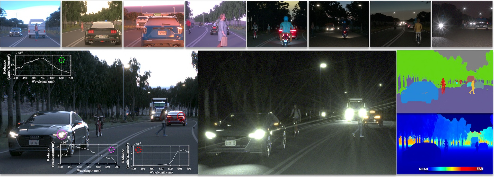

# ISETHDRsensor

This repository contains functions and scripts designed to evaluate High Dynamic Range (HDR) imaging sensor architectures, with a focus on nighttime driving scenes. The tools provided here are for researchers and engineers working on HDR imaging systems, particularly in automotive applications.

### [`Arxiv`](https://arxiv.org/pdf/2408.12048) ISETHDR: A Physics-based Synthetic Radiance Dataset for High Dynamic Range Driving Scenes  

Look at this [repository's Wiki](https://github.com/ISET/isethdrsensor/wiki) for scripts that create the images in that paper.

## Dependencies

### Other ISET repositories
The code in this repository relies on the following tools:

- [ISETCam](https://github.com/ISET/isetcam): A Matlab toolbox for simulating camera imaging systems.
```
git clone https://github.com/ISET/isetcam
```
To run the neural network for denoising and demosaicing, you will also need to have a Matlab Python environment.  See the instructions for creating a Python environment on the [ISETCam wiki pages]()

### Python libraries for RGBW rendering

To run the demosaicing code, we need to [install a Python environment within Matlab](https://github.com/ISET/isetcam/wiki/Related-software), and then add in the Python libraries specified in the file (isethdrsensor/utility/python/requirements.txt).  These libraries are used by the neural network code that performs the demosaicing and denoising here.

To install the requirements, you can use
```
pip install -r requirements.txt
```
## Overview

The scripts in this repository utilize HDR driving scenes to simulate the responses of various sensors modeled in ISETCam. Our primary focus is on evaluating two specific sensor architectures:

1. **RGBW Sensor**: A sensor architecture that includes red, green, blue, and white pixels to capture a broader range of brightness levels.
2. **Omnivision 3-Capture Sensor**: A sensor designed by Omnivision that uses multiple captures to extend dynamic range.

A second contribution is a set of scenes that are rendered into light groups (see the paper for details).  A light group can be used to create an ISETCam scene spectral radiance, either for day, dusk or night conditions. To browse an overview of the light groups we use fiftyone.  It can be installed and then run this way
```   
pip install fiftyone
```
And then this command will bring up a viewer to see what is in the scenes
```   
fiftyone app connect --destination mux.stanford.edu
```
(August, 2024:  We are still working out the privileges of the program and mux.stanford.edu to enable secure access for viewing the data.)

## Usage

### Running the Simulations

To run the simulations, ensure that you have the necessary dependencies installed. Then, use the provided scripts to evaluate the performance of the sensor architectures under different driving scenes. The scripts generate response data and figures that illustrate the sensor performance.

### Reproducing Figures from the Paper

The scripts in this repository were used to generate most of the figures in the paper titled "ISETHDR: A Physically Accurate Synthetic Radiance Dataset for High Dynamic Range Driving Scenes," currently in preparation. You can modify the parameters in the scripts to explore different scenarios or reproduce the figures.

## Data
The data required for the /figures and /scripts directories is stored in the [Stanford Digital Repository (SDR)](https://searchworks.stanford.edu/view/bt316kj3589) Feel free to check it in your web browser.

The corresponding data from SDR will be automatically pulled for the scripts. A data folder will be created for the scene data, and a networks folder will be created for the pretrained ONNX network used for demosaicing and denoising, as described in the Experiments/RGBW Sensor section of the paper.
## Contributing

Contributions are welcome! If you have suggestions for improvements or new features, please feel free to open an issue or submit a pull request.

## License

This project is licensed under the [MIT License](LICENSE).

## Acknowledgments

Special thanks to the developers of ISETCam, ISETAuto, and ISET3d for their invaluable tools that made this work possible.
